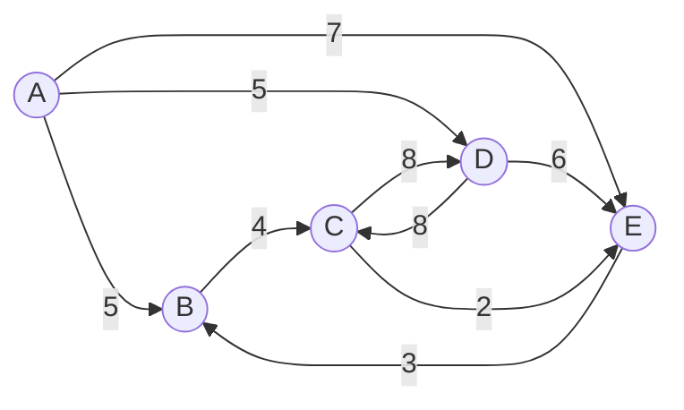

# tech-test

Você **não poderá usar bibliotecas externas** ou ferramentas para propósito de criação ou teste. Especificamente, você poderá usar bibliotecas de testes unitários ou ferramentas de build disponíveis para a linguagem que você escolher (por exemplo, Nunit, MSTest, etc).

**Precisaremos rodar e compilar o seu código**. Por favor encaminhe uma breve descrição do design e suposições junto com o seu código, bem como as instruções detalhadas de como rodar sua aplicação.

 Não é necessário que você trabalhe nos mínimos detalhes da solução, porém estaremos procurando algo mais que somente o esqueleto do código.

O programa deve ser escrito usando o desenvolvimento orientado a testes, seguindo as etapas de refatoração vermelhas e verdes.
Não sacrifique TDD para completar a solução, isso resultará em uma falha.
Avaliaremos uma variedade de aspectos, como design da solução, SOLID e orientação a objeto. Mesmo que estes problemas não sejam extensos, nós esperamos que você encaminhe um código que acredite ser de qualidade, um código possível de ser rodado e evoluído.

## Introdução:

 - Deve haver uma maneira de prover um arquivo como entrada de dados para a aplicação
 - A aplicação deve executar
 - Você deve prover evidências suficientes de que sua solução está completa indicando, no mínimo, que ela funciona utilizando os dados de teste que são fornecidos

## Problema
A estrada de ferro local presta serviços de manutenção a um número de cidades em Ipatinga. Por causa de preocupações financeiras, todas as faixas são "unidirecionais". Ou seja, uma rota de Ipatinga para Vitória não implica a existência de uma rota de Vitória para Ipatinga. De fato, mesmo que ambas as rotas existam, elas são distintas e não são necessariamente a mesma distância!
 
O objetivo deste problema é ajudar a ferrovia a fornecer aos seus clientes informações sobre as rotas (calcular a distância ao longo de uma determinada rota, o número de rotas diferentes entre duas cidades e a rota mais curta entre duas cidades).
 
**Entrada:** Um gráfico direcionado em que um nó representa uma cidade e uma ligação representa uma rota entre duas cidades. O peso da ligação representa a distância entre as duas cidades. Uma determinada rota nunca aparecerá mais de uma vez e, para uma determinada rota, a cidade inicial e final não será a mesma cidade.
 
**Saída:** Para entrada de teste de 1 a 5, se não houver tal rota exibir 'NAO EXISTE ROTA'. Caso contrário, siga a rota como dada; não faça paradas extras! Por exemplo, o primeiro problema significa começar na cidade A, depois viajar diretamente para a cidade B (uma distância de 5) e, em seguida, diretamente para a cidade C (uma distância de 4).

 1. A distância da rota A-B-C. 
 2. A distância da rota A-D. 
 3. A distância da rota A-D-C. 
 4. A distância da rota A-E-B-C-D. 
 5. A distância da rota A-E-D.
 6. O número de viagens começando em C e terminando em C com um máximo de 3 paradas. Nos dados de amostra abaixo, existem duas viagens: C-D-C (2 paradas). e C-E-B-C (3 paradas). 
 7. O número de viagens começando em A e terminando em C com exatamente 4 paradas. Nos dados de amostra abaixo, existem três viagens: A a C (via B, C, D); A para C (via D, C, D); e A para C (via D, E, B). 
 8. O comprimento da rota mais curta (em termos de distância para viajar) de A para C. 
 9. O comprimento da rota mais curta (em termos de distância para viajar) de B para B. 
 10. O número de rotas diferentes de C a C com uma distância inferior a 30. Nos dados da amostra, as viagens são: CDC, CEBC, CEBCDC, CDCEBC, CDEBC, CEBCEBC, CEBCEBCEBC.

**Entrada de Teste:**
Para a entrada de teste, as cidades são nomeadas usando as primeiras letras do alfabeto de A a D. Uma rota entre duas cidades (A a B) com uma distância de 5 é representada como AB5.
Gráfico: AB5, BC4, CD8, DC8, DE6, AD5, CE2, EB3, AE7

**Saída esperada:**
Saída 1: 9
Saída 2: 5
Saída 3: 13
Saída # 4: 22
Saída # 5: NO TAIS ROTA
Saída 6: 2
Saída 7: 3
Saída 8: 9
Saída 9: 9
Saída 10: 7